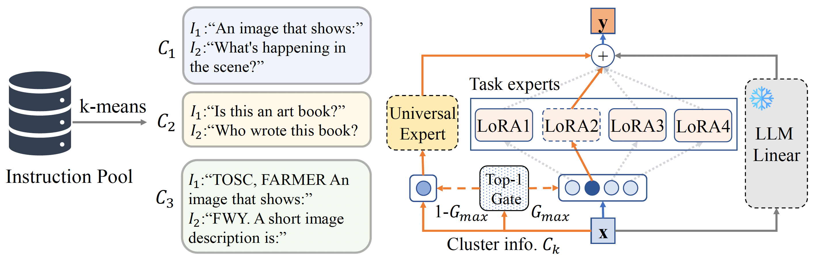

# MoCLE
[](https://arxiv.org/abs/2312.12379) [](https://kaichen1998.github.io/projects/mocle/) [](https://huggingface.co/collections/KaiChen1998/mocle-66135eb69c0d0687a15ec671)

This repository contains the implementation of the paper:

> MoCLE: Mixture of Cluster-conditional LoRA Experts for Vision-language Instruction Tuning <br>
> [Yunhao Gou*](https://gyhdog.github.io/), [Zhili Liu*](https://scholar.google.com/citations?user=FdR09jsAAAAJ&hl=zh-CN), [Kai Chen*](https://kaichen1998.github.io/), [Lanqing Hong](https://scholar.google.com/citations?hl=zh-CN&user=2p7x6OUAAAAJ&view_op=list_works&sortby=pubdate), [Hang Xu](https://xuhangcn.github.io/), [Aoxue Li](https://dblp.org/pid/152/6095.html), [Dit-Yan Yeung](https://sites.google.com/view/dyyeung/home), [James T. Kwok](https://www.cse.ust.hk/~jamesk/), [Yu Zhang†](https://yuzhanghk.github.io/) <br>
> *Equal contribution †Corresponding Author <br>
> *Arxiv preprint, 2023*

<!--  -->


## Installation


1. Install [LAVIS](https://github.com/salesforce/LAVIS) to the current directory, the primary codebase on which MoCLE is built.

    ```shell
    conda create -n lavis python=3.8
    conda activate lavis
    git clone https://github.com/salesforce/LAVIS.git
    cd LAVIS
    pip install -e .
    ```

2. Clone the repository of MoCLE.

   ```shell
   git clone https://github.com/gyhdog99/mocle.git
   ```

3. Build our modified [PEFT](https://github.com/huggingface/peft) package.
    ```Shell
    cd mocle
    cd peft-main
    pip install -e .
    ```
    
4. Copy ```mocle.py``` and ```mocle.yaml``` in this repository into the LAVIS directory following the architecture below:

    ```shell
    cd ../
    cp mocle.py ../lavis/models/blip2_models
    cp mocle.yaml ../lavis/configs/models/blip2
    ```
    
5. Modify ```../lavis/models/__init__.py``` in LAVIS as follows:
   - Add  ```from lavis.models.blip2_models.mocle import MoCLE``` in the beginning of the file.
   - Add ```"MoCLE"``` to ```__all__ = [...,...]```.

## Prepare Models
1. MoCLE is based on Vicuna-7B-v1.1. Download the corresponding LLM checkpoint [here](https://huggingface.co/lmsys/vicuna-7b-v1.1).
2. Set the ```llm_model``` argument in ```../lavis/configs/mocle.yaml``` to the local path towards the downloaded Vicuna checkpoint.
3. Download the pre-trained checkpoint of MoCLE.

    | # Clusters | Temperature | Main Model | Clustering Model |
    |:--:|:----:|:-----:|:-----:|
    | 16 | 0.05 | [c16_t005](https://huggingface.co/KaiChen1998/mocle-c16-t005) | [c16](https://huggingface.co/KaiChen1998/mocle-cluster16) |
    | 64 | 0.05 | [c64_t005](https://huggingface.co/KaiChen1998/mocle-c64-t005) | [c64](https://huggingface.co/KaiChen1998/mocle-cluster64) |
    | 64 | 0.10 | [c64_t010](https://huggingface.co/KaiChen1998/mocle-c64-t01) | [c64](https://huggingface.co/KaiChen1998/mocle-cluster64) |
4. Set ```finetuned``` and ```kmeans_ckpt``` in ```../lavis/configs/mocle.yaml``` to the weights of the downloaded main model and clustering model, respectively. 
(Please adjust the ```total_tasks``` and ```gates_tmp``` parameters as ```# Clusters``` and ```Temperature``` accordingly). 

## Model Inference 

1. Load an image locally

    ```python
    import torch
    from PIL import Image
    # setup device to use
    device = torch.device("cuda") if torch.cuda.is_available() else "cpu"
    # load sample image
    raw_image = Image.open(".../path_to_images/").convert("RGB")
    ```

2. Load the models 

    ```python
    from lavis.models import load_model_and_preprocess
    # loads MoCLE model
    model, vis_processors, _ = load_model_and_preprocess(name="mocle", model_type="mocle", is_eval=True, device=device)
    # prepare the image
    image = vis_processors["eval"](raw_image).unsqueeze(0).to(device)
    ```

3. Generate

    ```python
    response = model.generate({"image": image, "prompt": ["Your query about this image"]})
    print(response)
    ```

## Model Training
Coming soon.

## Acknowledgement
+ [LAVIS](https://github.com/salesforce/LAVIS): Implementations of our MoCLE are built upon LAVIS.
+ [PEFT](https://github.com/huggingface/peft): Implementations of our Mixture of LoRA experts are based on PEFT.

## Citation

If you're using MoCLE in your research or applications, please cite using this BibTeX:

```bibtex
@article{gou2023mixture,
  title={Mixture of cluster-conditional lora experts for vision-language instruction tuning},
  author={Gou, Yunhao and Liu, Zhili and Chen, Kai and Hong, Lanqing and Xu, Hang and Li, Aoxue and Yeung, Dit-Yan and Kwok, James T and Zhang, Yu},
  journal={arXiv preprint arXiv:2312.12379},
  year={2023}
}
```
